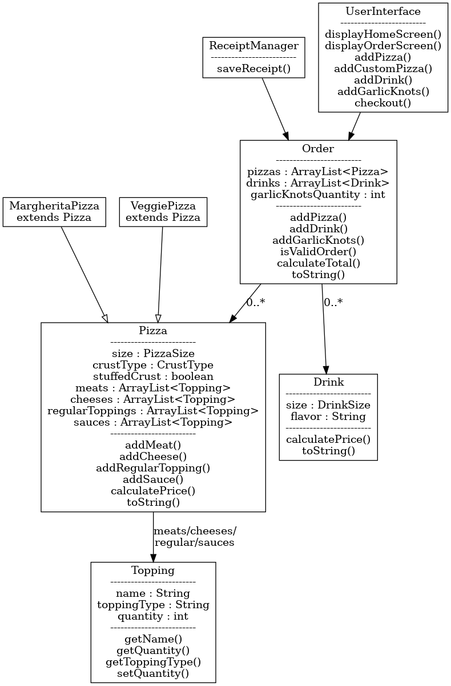

# PIZZA-licious

A Java console-based pizza ordering application for a custom pizza shop. Customers can create custom pizzas, order signature pizzas, add drinks and garlic knots, review their order, and save a receipt at checkout.

## Features

- Home screen with new order and exit options
- Order screen with pizza, drink, garlic knots, checkout, and cancel options
- Custom pizzas with size, crust, stuffed crust, toppings, sauces, and extras
- Signature pizzas using inheritance:
  - Margherita Pizza
  - Veggie Pizza
- Signature pizza customization by adding or removing toppings
- Drinks with size and flavor
- Garlic knots with quantity
- Order summary with newest entries first
- Receipt files saved in the `receipts` folder

## Object-Oriented Concepts

- `MargheritaPizza` and `VeggiePizza` extend `Pizza`
- `Pizza`, `Drink`, and `GarlicKnots` implement `OrderItem`
- `Order` uses an `ArrayList` to store order entries
- Enums represent pizza sizes, drink sizes, and crust types
- `ReceiptManager` handles file writing

## UML Diagram

## How to Run

1. Open the project in IntelliJ IDEA.
2. Build the project.
3. Run `com.pizzalicious.app.Main`.

## Author

Abdulmelik Tuhaye
